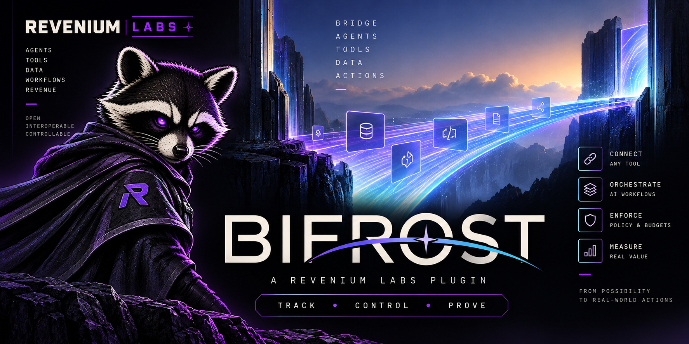

[](assets/bifrost-revenium-labs.png)

[](https://github.com/revenium/.github/blob/main/LABS.md) [](#what-it-does)

> ### This is a Revenium Labs project
>
> Revenium Labs projects are built in the field and shared as best-effort beta software. They are not part of Revenium's officially supported products.
>
> * You may need to adapt this plugin for your environment.
> * It is provided as-is, without the versioned release guarantees, SLAs, or formal support behind our core products.
> * Issues, feedback, and PRs are welcome. [Join us on Discord](https://discord.gg/J2DbmjZ2nA).
>
> [Read about Revenium Labs](https://github.com/revenium/.github/blob/main/LABS.md)

> This is a Revenium project. It is neither part of nor endorsed by the Bifrost project.
> Bifrost is a trademark of its respective owners; this plugin is an independent integration built
> entirely on Bifrost's public native-plugin extension points.

# Revenium Bifrost plugin

> A native Go plugin that adds budget enforcement and AI usage metering to the [Bifrost LLM proxy](https://docs.getbifrost.ai/). It meters model calls and stops over-budget calls at the gateway.

[](https://golang.org/)
[](https://docs.revenium.io)
[](https://www.revenium.ai)
[](https://opensource.org/licenses/MIT)

---

## What it does

The Revenium Bifrost Plugin loads into Bifrost as a native shared object (`.so`) and instruments every LLM call that flows through the proxy:

- Meters successful, failed, and budget-blocked completions to Revenium with token, timing, and identity context. For a streaming response, the plugin emits one event on the final chunk, including time to first token.
- Checks the request's subscriber before dispatch. If the subscriber is over budget, the plugin returns **HTTP 429** without calling the upstream provider.
- Fails open if the budget service times out, cannot be reached, or returns an error. A Revenium outage will not take Bifrost traffic down.
- Reads per-request `x-revenium-*` headers for subscriber, organization, product, agent, task type, and trace attribution.

The same enforcement and metering path works across the providers Bifrost routes to, including OpenAI and Anthropic.

---

## Table of contents

- [Installation](#installation)
- [Header reference](#header-reference)
- [Environment variables](#environment-variables)
- [Compatibility matrix](#compatibility-matrix)
- [Building from source](#building-from-source)
- [Operations](#operations)
- [FAQ and troubleshooting](#faq-and-troubleshooting)
- [License](#license)
- [Support](#support)

---

## Installation

The plugin ships as a native Go shared object (`.so`). Bifrost loads it at startup via the `plugins` block of `config.json`.

### 1. Download the artifact for your OS and architecture

Grab the `.so` matching your Bifrost host from the [Releases page](https://github.com/revenium/revenium-bifrost-plugin/releases).

Filename pattern: `revenium-bifrost_<TAG>_<GOOS>_<GOARCH>_go1.26.2.so`

| Artifact | Target |
| --- | --- |
| `revenium-bifrost_v0.1.0_linux_amd64_go1.26.2.so` | Linux x86_64 |
| `revenium-bifrost_v0.1.0_linux_arm64_go1.26.2.so` | Linux ARM64 |
| `revenium-bifrost_v0.1.0_darwin_amd64_go1.26.2.so` | macOS Intel |
| `revenium-bifrost_v0.1.0_darwin_arm64_go1.26.2.so` | macOS Apple Silicon |

Each release also publishes per-artifact `.sha256` files and a combined `checksums.txt`.

> **Windows is not supported.** Bifrost's native plugin loader only loads `.so` files on Linux and macOS. Run Bifrost in a Linux container on a Windows host.

### 2. Verify the checksum

```bash
# Linux
sha256sum -c revenium-bifrost_v0.1.0_linux_amd64_go1.26.2.so.sha256

# macOS (sha256sum isn't installed by default)
shasum -a 256 -c revenium-bifrost_v0.1.0_darwin_arm64_go1.26.2.so.sha256
```

### 3. Copy it into Bifrost's plugin directory

Place the `.so` where your Bifrost deployment can read it. The path must match the value in `config.json`.

```bash
# Linux
install -m 0644 revenium-bifrost_v0.1.0_linux_amd64_go1.26.2.so /etc/bifrost/plugins/revenium-bifrost.so
```

```dockerfile
# Container image
COPY revenium-bifrost_v0.1.0_linux_amd64_go1.26.2.so /opt/bifrost/plugins/revenium-bifrost.so
```

### 4. Reference the plugin from `config.json`

```json
{
  "client": {
    "drop_excess_requests": false,
    "initial_pool_size": 1
  },
  "providers": {
    "openai": {
      "keys": [
        { "name": "default", "value": "env.OPENAI_API_KEY", "models": ["*"], "weight": 1.0 }
      ]
    }
  },
  "plugins": [
    { "enabled": true, "name": "revenium", "path": "./plugins/revenium-bifrost.so" }
  ]
}
```

> **Never inline secrets.** Source credentials from the environment (`env.OPENAI_API_KEY` above and the Revenium variables in [Environment variables](#environment-variables)). The plugin reads its API key from the process environment when it loads. Do not commit secrets next to `config.json`.

Per-provider key fields:

| Field | Meaning |
| --- | --- |
| `name` | Operator-defined label for the key (shown in Bifrost logs and admin UI). |
| `value` | The literal API key, or `env.NAME` to source from an environment variable. |
| `models` | Models this key may serve. `["*"]` allows any model; all others are denied unless listed. |
| `weight` | Relative weight when load-balancing across multiple keys for a provider. |

### 5. Start or restart Bifrost

Plugins load at startup. There is no hot reload (see [Operations](#operations)). A successful load prints one line:

```
[Revenium] plugin loaded: name=revenium version=v0.1.0 base_url=https://api.revenium.ai
```

If this line is missing, the plugin did not load. Check the logs and the [FAQ](#faq-and-troubleshooting). The usual causes are a missing environment variable or a Go version mismatch.

### 6. Send a metered request

```bash
curl -s http://localhost:8080/v1/chat/completions \
  -H 'Content-Type: application/json' \
  -H 'x-revenium-subscriber-id: cust_alice' \
  -H 'x-revenium-organization-name: Acme Corporation' \
  -H 'x-revenium-agent: support-bot-v3' \
  -H 'x-revenium-trace-id: 01HXYZABCDE' \
  -d '{"model":"gpt-4o-mini","messages":[{"role":"user","content":"hello"}]}'
```

The completion is now metered to Revenium with the attribution from the request headers.

---

## Header reference

The plugin reads up to twelve `x-revenium-*` headers on each request. All are optional. If a header is absent, the plugin omits its payload field rather than sending an empty string. Header matching is case-insensitive.

`x-revenium-key-hash` controls the pre-call budget check. If it is absent, the plugin skips the budget check and meters the completed call.

| Header | Metering field | Example |
| --- | --- | --- |
| `x-revenium-key-hash` | _drives budget check (not stored)_ | `sha256:a3f4…` |
| `x-revenium-subscriber-id` | `subscriber.id` | `cust_01HXYZ…` |
| `x-revenium-subscriber-email` | `subscriber.email` _(also credential fallback)_ | `alice@example.com` |
| `x-revenium-organization-name` | `organizationName` | `Acme Corporation` |
| `x-revenium-organization-id` | `organizationId` | `org_01HXYZ…` |
| `x-revenium-product-name` | `productName` | `Support Copilot` |
| `x-revenium-product-id` | `productId` | `prod_01HXYZ…` |
| `x-revenium-agent` | `agent` | `support-bot-v3` |
| `x-revenium-task-type` | `taskType` | `summarization` |
| `x-revenium-trace-id` | `traceId` | `01HXYZABCDE…` |
| `x-revenium-subscription-id` | `subscriptionId` | `sub_01HXYZ…` |
| `x-revenium-response-quality-score` | `responseQualityScore` | `0.92` |

### Organization and product: name versus ID

Each header maps to its own payload field. `*-name` populates `organizationName` or `productName`, while `*-id` populates `organizationId` or `productId`. The plugin sends each value independently and verbatim.

> Revenium uses the name as the primary human-readable identifier for organizations and products. Send the `*-name` header to include an organization or product in Revenium analytics. Use `*-id` only for a real Revenium ID; an arbitrary label will not resolve on the server.

### Email as a credential fallback

If `x-revenium-subscriber-email` is set but no separate subscriber credential is provided, the email is also used as the credential for Revenium subscriber lookup.

### Headers are per request

Identity comes from request headers. The plugin has no static identity configuration, so it does not need to mutate global identity state between tenants.

---

## Environment variables

The process environment contains all plugin configuration. There is no plugin-specific `config.json` block. Set these variables on the Bifrost host with systemd `Environment=`, Docker `-e`, or Kubernetes `env:`.

### Required

```bash
REVENIUM_METERING_BASE_URL=https://api.revenium.ai   # Revenium API root
REVENIUM_METERING_API_KEY=<your-metering-key>        # keep in a secret store
```

| Variable | Purpose |
| --- | --- |
| `REVENIUM_METERING_BASE_URL` | Revenium API root. The plugin appends the budget-check and metering paths. |
| `REVENIUM_METERING_API_KEY` | Revenium-issued metering key. Treat it as a secret and source it from a vault, Kubernetes Secret, or systemd credential. Never commit it. |

> If either required variable is missing, the plugin aborts while loading and Bifrost refuses to start. A startup failure is preferable to discovering days later that the plugin did not meter any calls.

### Optional

```bash
REVENIUM_DEBUG=true      # elevate plugin logging from INFO to DEBUG
REVENIUM_DRY_RUN=true    # run the budget check but NEVER block the request
```

| Variable | Effect |
| --- | --- |
| `REVENIUM_DEBUG` | Logs full budget-check and metering payloads. Use it during initial integration or an investigation, not as the production default. |
| `REVENIUM_DRY_RUN` | Runs and logs the budget check but always allows the request. Metering still emits with a `would_have_blocked` flag. Use this setting to validate budget configuration before enforcing it. |

A truthy value is `true`, `1`, `yes`, `on`, or any non-empty value other than `false`, `0`, `no`, or `off` (case-insensitive). An empty or unset value is false.

---

## Compatibility matrix

| Plugin | Bifrost | Go |
| --- | --- | --- |
| `v0.1.0` | `core/v1.5.11` + `transports/v1.5.3` | `go1.26.2` |

> The plugin's Go toolchain version must exactly match the toolchain used to build the Bifrost binary. On a mismatch, `plugin.Open` fails with `package was built with a different version of package runtime`. This constraint comes from Go's `plugin` package.

Upgrade Bifrost and this plugin together. Each row above is a verified combination. When Bifrost adds a new release line, such as v1.6.x, a new plugin minor version will target it. Older rows remain valid for hosts that have not upgraded.

Check the Bifrost binary if you do not know which Go version built it:

```bash
go version -m /path/to/bifrost-http | head -1   # first line = the Go toolchain you must match
```

---

## Building from source

Most users should download a released `.so`. Build from source when your Bifrost host was built against a Go patch version different from the released artifact.

```bash
git clone https://github.com/revenium/revenium-bifrost-plugin.git
cd revenium-bifrost-plugin
make build
```

The build command:

```bash
CGO_ENABLED=1 go build -buildmode=plugin -trimpath -o revenium-bifrost.so .
```

- `-trimpath` is required. Released artifacts use it, and a local build needs the same flag to be byte-comparable.
- Do not add `-ldflags=-s` or `-ldflags=-w`. These flags strip the symbol table the Go runtime needs. The `.so` may open, but its symbol lookups will fail during Bifrost startup.

Verify the exported symbols after building:

```bash
nm revenium-bifrost.so | grep -cE ' T _?github\.com/revenium/revenium-bifrost-plugin\.(Init|GetName|Cleanup|HTTPTransportPreHook|PreLLMHook|PostLLMHook|HTTPTransportStreamChunkHook)$'
```

Expect `7`, the number of exported symbols Bifrost looks up. Any other result indicates build-flag drift, usually a stripped symbol table.

---

## Operations

### Reconfiguration requires a restart

The Go `plugin` contract is one-shot. After a process loads a `.so`, it cannot reload that file or the `config.json` parsed at startup. There is no SIGHUP path. Apply changes to environment variables, `config.json`, or the `.so` with a rolling restart, blue-green deployment, or drain-and-replace systemd units.

### Kubernetes: set `terminationGracePeriodSeconds: 30`

On shutdown, Bifrost waits synchronously for the plugin to flush its in-flight metering buffer. Retries can make that take a few seconds. Give the process enough time to prevent the kubelet from sending `SIGKILL` during the flush:

```yaml
spec:
  terminationGracePeriodSeconds: 30
  containers:
    - name: bifrost
      image: your-org/bifrost:tagged
      env:
        - name: REVENIUM_METERING_BASE_URL
          value: https://api.revenium.ai
        - name: REVENIUM_METERING_API_KEY
          valueFrom:
            secretKeyRef:
              name: revenium-credentials
              key: api-key
```

### macOS: Gatekeeper and quarantine

Released artifacts are ad hoc codesigned and load on a default-policy macOS host. A quarantine-enforced fleet may block a downloaded `.so` on its first load:

```bash
sha256sum -c <name>.so.sha256          # 1. ALWAYS verify the checksum first
xattr -d com.apple.quarantine <name>.so # 2. then strip quarantine if needed
```

> Verify the checksum before removing quarantine. Otherwise, a tampered artifact can bypass Gatekeeper.

### Logging

Bifrost's logger emits plugin lines with a `[Revenium]` prefix:

```
[Revenium] plugin loaded: name=revenium version=v0.1.0
[Revenium] budget check: subscriber=cust_alice decision=allow latency=12ms
[Revenium] metering event sent: trace=01HXYZ tokens_in=120 tokens_out=80
```

With `REVENIUM_DEBUG=true`, the logs also include the full budget-check request, response, and metering payload.

### Metrics and observability

This release reports operational data through the structured logs above. Native Prometheus metrics and OpenTelemetry spans are planned for a future release.

### Request hook lifecycle

The plugin runs these hooks for each request:

1. **Header capture:** Before parsing, the plugin copies `x-revenium-*` headers from the raw HTTP request into the request context. Header matching happens here and is case-insensitive.
2. **Pre-call budget check:** After parsing and before dispatch, the plugin calls the Revenium budget-check API when `x-revenium-key-hash` is present. A `block` decision returns **HTTP 429** with `AllowFallbacks=false`. An allow decision, timeout, transport error, or non-200 response lets the call proceed.
3. **Post-call metering:** After the provider responds, the plugin emits a **blocked** event for a short-circuited call and exits to avoid double counting. Otherwise, it emits a **success** or **failure** event.
4. **Streaming roll-up:** For a streaming response, token counts accumulate across chunks. The terminal chunk emits one event with time to first token. Post-call metering does nothing for streaming responses; only the chunk hook emits.

This is documented for diagnostics only; the stable contract is the headers and environment variables above.

### Identity payload semantics

Request headers populate `subscriber`, `organizationName`/`organizationId`, `productName`/`productId`, `agent`, `taskType`, and `traceId`. The plugin omits absent headers instead of sending empty strings because Revenium analytics distinguish between absent and empty values.

---

## FAQ and troubleshooting

### Why does Bifrost refuse to load the `.so`?

A Go toolchain mismatch between the Bifrost binary and the plugin is the most common cause.

```bash
go version -m /path/to/bifrost-http | head -1
```

If that first line isn't `go1.26.2`, [build from source](#building-from-source) against your host's exact toolchain. Less common causes:

- Wrong OS or architecture. Verify that the filename matches your host's `GOOS_GOARCH`.
- Bifrost cannot read the file. Run `chmod 0644` and check ownership.
- The plugin was built with `-ldflags=-s` or `-w`, which stripped its symbols. Rebuild without those flags and run the `nm` check.
- macOS quarantined the file. See [Why does macOS block loading the `.so`?](#why-does-macos-block-loading-the-so)

### Why isn't my request being metered?

- Confirm that `REVENIUM_METERING_BASE_URL` and `REVENIUM_METERING_API_KEY` are set on the Bifrost process, not only in your shell. The plugin aborts at load if either is missing, so check the startup logs.
- Calls without `x-revenium-*` headers are still metered, but they lack the corresponding subscriber, organization, product, and trace context.
- Enable `REVENIUM_DEBUG=true` and look for a log line for each request. If no line appears, traffic is bypassing Bifrost or the plugin.
- The plugin sends outbound HTTPS requests to `REVENIUM_METERING_BASE_URL`. Allowlist that host in a restricted network. Because the plugin fails open, blocked egress allows the LLM call but prevents metering.

### Why does macOS block loading the `.so`?

Gatekeeper quarantines downloaded `.so` files on quarantine-enforced hosts.

```bash
sha256sum -c <name>.so.sha256            # verify first
xattr -d com.apple.quarantine <name>.so  # then de-quarantine
```

Released artifacts are ad hoc codesigned and load without intervention on default-policy hosts. The `xattr` step is only for managed-device fleets. Developer ID signing and notarization are planned.

### Does it support hot reload?

No. The Go `plugin` contract is one-shot per process. Restart Bifrost to change its configuration, environment variables, or `.so`. Use a rolling restart when possible. There is no SIGHUP path.

---

## License

Licensed under the MIT License. See [LICENSE](https://github.com/revenium/revenium-bifrost-plugin/blob/HEAD/LICENSE).

---

## Support

- Repository: [revenium/revenium-bifrost-plugin](https://github.com/revenium/revenium-bifrost-plugin)
- Issues: [Report a bug or request a feature](https://github.com/revenium/revenium-bifrost-plugin/issues)
- Discord: [Join the Revenium community](https://discord.gg/J2DbmjZ2nA)
- Documentation: [docs.revenium.io](https://docs.revenium.io)
- Website: [revenium.ai](https://www.revenium.ai)

> Revenium Labs projects are best-effort and have no SLA or formal support commitment. Report security issues through the private process in [SECURITY.md](https://github.com/revenium/revenium-bifrost-plugin/blob/HEAD/SECURITY.md), not through a public issue.

---

<div align="center"><sub>Built by Revenium</sub></div>
